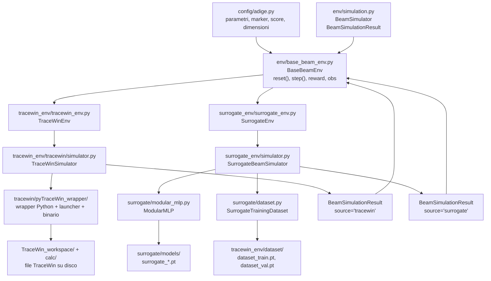
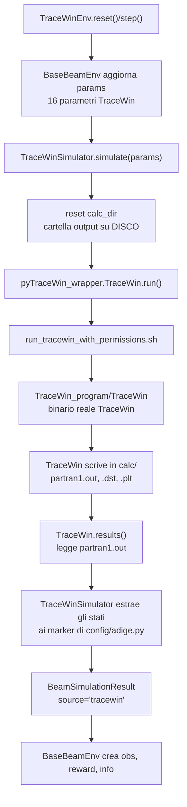
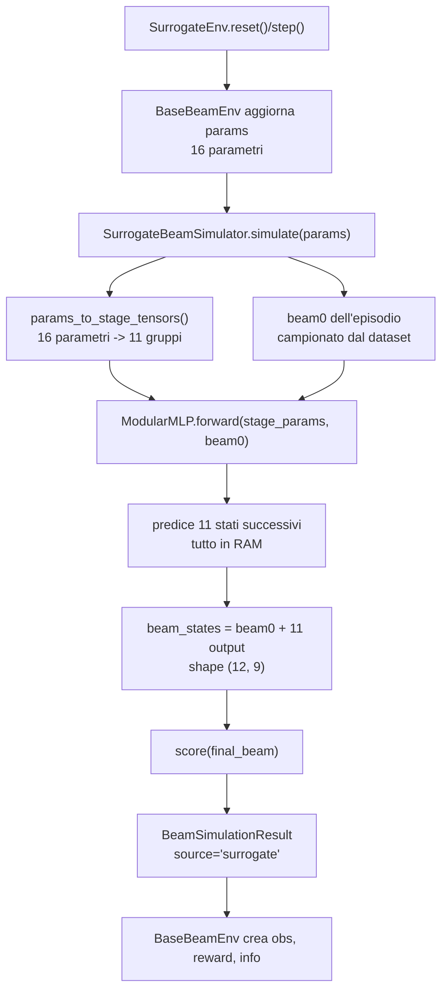
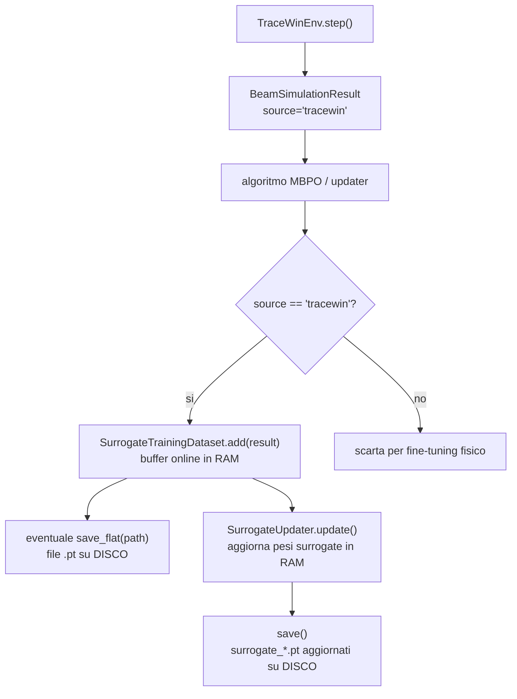

# Schema Della Cartella `env`

Questo file descrive solo la cartella `beam_optimization/env/`: qui vivono gli
ambienti Gymnasium, il simulatore TraceWin reale, il simulatore surrogate
neurale, i dataset usati dal surrogate e i file TraceWin necessari per lanciare
la fisica reale.

La cosa piu importante da tenere a mente e questa:

```text
TraceWinEnv e SurrogateEnv hanno la stessa forma esterna.
Entrambi fanno reset/step/evaluate_params.
La differenza e solo il motore che produce il risultato fisico.
```

## Come Siamo Arrivati Qui

Questa cartella non e nata cosi. La forma attuale e il risultato di una
serie di problemi concreti, risolti uno dopo l'altro.

**Il punto di partenza.** `TraceWinEnv` e `SurrogateEnv` erano due classi
indipendenti, ognuna con il proprio `reset()`/`step()` scritto a mano. Il
~80% del codice era identico in entrambe: stesso campionamento dei
parametri iniziali, stesso calcolo del reward, stessa logica di
troncamento dell'episodio. Solo `TraceWinEnv`, però, restituiva un
risultato strutturato (`SimResult`); `SurrogateEnv` faceva il forward del
`ModularMLP` inline, dentro `_evaluate()`, senza costruire nessun oggetto
risultato.

**Prima unificazione.** E nato `BaseBeamEnv` per eliminare la duplicazione
del ciclo Gym (Template Method: la parte comune sta nella classe base, le
sottoclassi implementano solo il motore). Ma l'asimmetria tra i due motori
restava: `TraceWinSimulator` produceva un `SimResult`, il surrogato non
produceva niente di equivalente.

**Il problema concreto causato dall'asimmetria.** Durante il fine-tuning
online di `MBPOWithModelUpdate`, i pesi del surrogato aggiornati in RAM
non venivano mai salvati su disco — un primo problema, risolto con
`save_surrogates()`/`save_dataset()`. Ma parlando di come funziona il
fine-tuning e emersa una domanda piu di fondo: il surrogato produce un
equivalente di `SimResult`? La risposta era no, e il motivo era semplice:
non esisteva nessun "simulatore-surrogato" da confrontare con
`TraceWinSimulator` — il forward del modello viveva inline dentro
`SurrogateEnv`, senza un livello a parte.

**La soluzione.** E nato `env/simulation.py`: un contratto comune,
`BeamSimulator` (interfaccia: `simulate(params) -> BeamSimulationResult`)
e `BeamSimulationResult` (lo stesso `SimResult` di prima, ma con un campo
in piu, `source`, che vale `"tracewin"` o `"surrogate"`). E nato
`SurrogateBeamSimulator`, controparte simmetrica di `TraceWinSimulator`.
Da quel momento entrambi i motori restituiscono lo stesso tipo di
oggetto — ma il campo `source` impedisce che una predizione del surrogato
venga confusa con un dato fisico reale: sia `SurrogateUpdater.add()` sia
`MBPOWithModelUpdate.step()` controllano esplicitamente
`source == "tracewin"` prima di accettare un risultato per il
fine-tuning, cosi il surrogato non puo mai allenarsi sulle proprie stesse
previsioni.

**Conseguenze a cascata.** Il dataset (`BeamDataset`) e stato rinominato
`SurrogateTrainingDataset`, per chiarire che e specificamente il dataset
con cui si allena/affina il surrogato. Le cartelle dei modelli e dei
dataset si sono separate in `base/` (gli originali, mai toccati) e
`updated/` (le versioni cumulative che crescono con l'esperienza raccolta
online) — cosi non si rischia mai di sovrascrivere per errore i dati o i
pesi di partenza.

**Ultimo passo.** I path sparsi nei vari script sono stati centralizzati
in `config/paths.py`, e gli script stessi sono stati unificati sotto
un'unica interfaccia: `python -m beam_optimization {check,train,benchmark}`.

## Vista Generale



## Struttura Logica

```text
beam_optimization/env/
├── simulation.py
├── base_beam_env.py
├── surrogate_env/
│   ├── surrogate_env.py
│   ├── simulator.py
│   └── surrogate/
│       ├── dataset.py
│       ├── modular_mlp.py
│       ├── updater.py
│       └── models/
└── tracewin_env/
    ├── tracewin_env.py
    ├── dataset/
    └── tracewin/
        ├── simulator.py
        ├── TRACEWIN_GUIDE.md
        ├── TraceWin_workspace/
        ├── pyTraceWin_wrapper/
        └── visualize_distributions.ipynb
```

I file `__pycache__/` non fanno parte della logica del progetto: sono cache
generate automaticamente da Python.

## Contratto Comune: `env/simulation.py`

`env/simulation.py` contiene il contratto comune tra TraceWin reale e surrogate:

- `BeamSimulator`
- `BeamSimulationResult`

Un simulatore deve avere:

```python
simulate(params) -> BeamSimulationResult
```

Il risultato comune contiene:

```text
params       parametri usati nella simulazione
beam_states  stati del fascio, tipicamente shape (12, 9)
score_val    score fisico calcolato sul fascio finale
success      True se la simulazione e valida
source       "tracewin" oppure "surrogate"
error        messaggio di errore, se fallisce
final_beam   dizionario con le 9 variabili finali
metadata     dettagli specifici del backend
timestamp    quando e stato creato il risultato
```

Questo evita di avere due mondi separati: TraceWin e surrogate possono restituire
lo stesso tipo di oggetto, ma `source` mantiene chiara l'origine del dato.

## Base Comune: `env/base_beam_env.py`

`BaseBeamEnv` contiene la parte Gymnasium condivisa:

- spazio delle azioni;
- spazio delle osservazioni;
- scelta dei parametri iniziali a `reset`;
- applicazione dell'azione come delta sui parametri;
- calcolo del reward;
- conversione da `BeamSimulationResult` a osservazione;
- inserimento di `info["sim_result"]`.

Il reward e:

```text
reward = score_nuovo - score_precedente
```

Le osservazioni possono essere:

```text
obs_mode="full"              -> tutti gli stati: 12 * 9 = 108 valori
obs_mode="final"             -> solo fascio finale: 9 valori
obs_mode="final_with_beam0"  -> fascio iniziale + finale: 18 valori
```

Quindi gli ambienti specifici non devono riscrivere il ciclo RL. Devono solo
impostare `self.simulator`.

## Flusso TraceWin Reale



### File Coinvolti

`tracewin_env/tracewin_env.py`
: definisce `TraceWinEnv`, cioe l'ambiente Gymnasium che usa TraceWin reale.

`tracewin_env/tracewin/simulator.py`
: contiene `TraceWinSimulator`. E il livello applicativo: prepara la cartella
`calc`, lancia TraceWin, legge `partran1.out`, estrae gli stati del fascio e
costruisce `BeamSimulationResult(source="tracewin")`.

`tracewin_env/tracewin/pyTraceWin_wrapper/tracewin.py`
: contiene il wrapper tecnico `TraceWin`. Costruisce il comando batch, chiama il
launcher e legge i file prodotti da TraceWin.

`tracewin_env/tracewin/pyTraceWin_wrapper/run_tracewin_with_permissions.sh`
: launcher locale usato da Python per avviare TraceWin con l'utente e i
permessi corretti. Non e' versionato perche' dipende dalla macchina.

`tracewin_env/tracewin/pyTraceWin_wrapper/TraceWin_program/`
: contiene il binario TraceWin e i file collegati alla licenza/log.

`tracewin_env/tracewin/TraceWin_workspace/`
: contiene il progetto fisico TraceWin: `.ini`, `.dat`, `.dst`, mappe e file
necessari alla linea.

`calc/`
: non e codice. E la cartella di output della simulazione. TraceWin ci scrive
`partran1.out`, distribuzioni `.dst`, traiettorie `.plt` e altri file intermedi.

## Flusso Surrogate



### File Coinvolti

`surrogate_env/surrogate_env.py`
: definisce `SurrogateEnv`, cioe l'ambiente Gymnasium veloce. Non chiama
TraceWin: usa un modello neurale gia allenato.

`surrogate_env/simulator.py`
: contiene `SurrogateBeamSimulator`. Sceglie il modello dell'ensemble, campiona
il fascio iniziale `beam0`, chiama `ModularMLP` e costruisce
`BeamSimulationResult(source="surrogate")`.

`surrogate_env/surrogate/modular_mlp.py`
: contiene `ModularMLP`, la rete neurale surrogate. Riceve:

```text
beam_state_0     shape (batch, 9)
stage_params     lista di 11 tensori, uno per stage
```

e predice gli 11 stati successivi del fascio.

`surrogate_env/surrogate/dataset.py`
: contiene `SurrogateTrainingDataset`. Carica e gestisce i dati `.pt` usati per
allenare il surrogate e per campionare `beam0` negli episodi.

`surrogate_env/surrogate/models/`
: contiene checkpoint dei modelli surrogate, ad esempio `surrogate_0.pt`,
`surrogate_1.pt`, ecc. Questi sono pesi del modello, non dati di training.

## Dataset Del Surrogate

Il dataset principale viene salvato su disco in:

```text
env/tracewin_env/dataset/base/dataset_train.pt
env/tracewin_env/dataset/base/dataset_val.pt
```

Quando viene caricato da `SurrogateTrainingDataset.load(path)`, entra in RAM.

Formato flat:

```text
X shape (N, 25)
  primi 9 valori   -> beam_state_0
  ultimi 16 valori -> parametri TraceWin

Y shape (N, 99)
  11 stati successivi * 9 variabili = 99
```

Il surrogate pero non usa direttamente `X` e `Y` flat nel forward. Prima
`SurrogateTrainingDataset.get_training_batch()` converte:

```text
X, Y flat
  -> stage_params: 11 tensori
  -> beam_states: 12 tensori
```

Questa conversione serve per adattarsi alla struttura fisica della linea: il
modello e modulare e ragiona per stage, non come una rete unica piatta.

## RAM E Disco

| Oggetto | Dove vive | Cosa contiene |
| --- | --- | --- |
| `BeamSimulationResult` | RAM | Risultato di una singola simulazione |
| `SurrogateTrainingDataset` | RAM dopo il load | Tensori `X`, `Y`, `scores` |
| `dataset_train.pt`, `dataset_val.pt` | Disco | Dati TraceWin gia raccolti per training/validation |
| `surrogate_*.pt` | Disco | Pesi dei modelli surrogate |
| `TraceWin_workspace/` | Disco | Input fisici TraceWin: `.ini`, `.dat`, `.dst`, mappe |
| `calc/` | Disco | Output generati da TraceWin durante una run |
| `pyTraceWin_wrapper/` | Disco/codice | Wrapper Python, launcher e binario TraceWin |
| `info["sim_result"]` | RAM | Risultato passato dall'ambiente agli algoritmi |

## Fine-Tuning Online

Il fine-tuning online non deve usare dati inventati dal surrogate come se fossero
verita fisica.

Per questo il campo `source` e importante:

```text
source="tracewin"    -> dato reale, puo essere usato per aggiornare il surrogate
source="surrogate"   -> predizione del modello, non deve diventare target fisico
```

Il flusso corretto e:



Se non viene passato un path di salvataggio, il dataset online resta solo in RAM.
Se viene salvato con `save_flat()`, il file `.pt` contiene dati (`X`, `Y`,
`scores`, colonne e marker), non pesi del modello.

## Come Leggere La Cartella

Per capire il comportamento comune degli ambienti, parti da:

```text
env/simulation.py
env/base_beam_env.py
```

Per capire TraceWin reale:

```text
env/tracewin_env/tracewin_env.py
env/tracewin_env/tracewin/simulator.py
env/tracewin_env/tracewin/pyTraceWin_wrapper/tracewin.py
env/tracewin_env/tracewin/TRACEWIN_GUIDE.md
```

Per capire il surrogate:

```text
env/surrogate_env/surrogate_env.py
env/surrogate_env/simulator.py
env/surrogate_env/surrogate/modular_mlp.py
env/surrogate_env/surrogate/dataset.py
```

Per capire i dati:

```text
env/tracewin_env/dataset/base/
env/tracewin_env/dataset/updated/
env/surrogate_env/surrogate/models/
```

## Riassunto Mentale

```text
BaseBeamEnv
  decide come funziona un episodio RL.

TraceWinEnv
  usa BaseBeamEnv + TraceWinSimulator.
  E lento, ma produce dati fisici reali.

SurrogateEnv
  usa BaseBeamEnv + SurrogateBeamSimulator.
  E veloce, ma produce predizioni neurali.

BeamSimulationResult
  e il formato comune che permette agli algoritmi di ricevere sempre
  params, beam_states, score, success e source.
```
